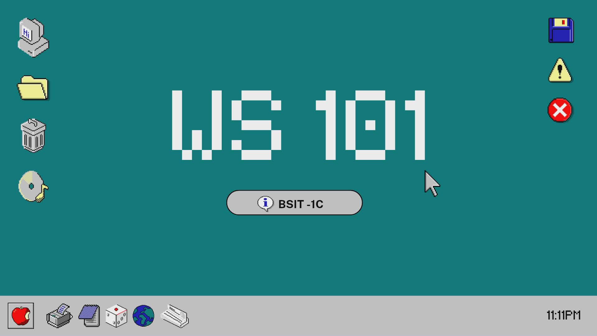

<h1 align="center">Hi 👋, I'm Trixia</h1>

<h1>🎀<b>About Me</b></h1>

My name is Trixia, you can call me xia. I can say that I'm friendly and approachable. I enjoy drinking coffee with friends and family, also spending time with them. I'm a kind of person who loves to learn new things

<h2>What I believe In:</h2>
<ul type = circle>
    <li>You need to respect everyone, either living or non living things.</li>
    <li>Hard work pays off.</li>
    <li>Positive mindset.</li>
</ul>
<h2>❤️<b>I Love:</b></h2>
<ul type = "disc">
<li>🎧 Listening to music while reviewing</li>
<li>☕️ Drinking coffee</li>
<li>🎮 Playing online games</li>
</ul>
<h2>📌<b>Skills</b></h2>
<ul type = "disc">
<li>⏰ Time management</li>
<li>🔍 Attention to detail</li>
<li>😴 Works well even with limited sleep</li>
<li>📋 Organization skills</li>
</ul>

<h3 align="left">Connect with me:</h3>

<h3 align="left">Languages and Tools:</h3>

    

